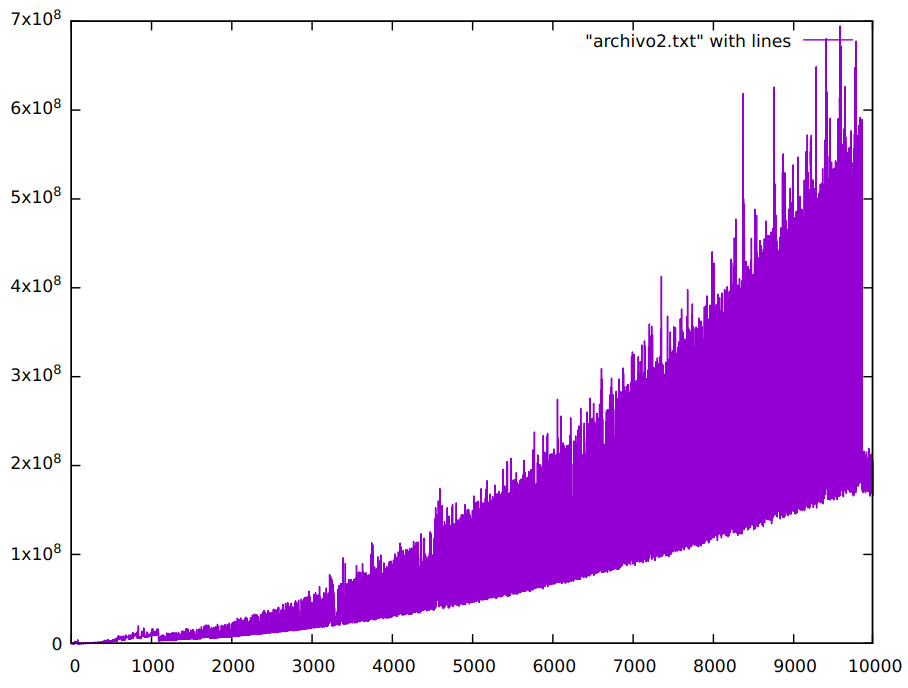

<table>
    <theader>
        <tr>
            <td></td>
            <th>
                UNIVERSIDAD NACIONAL DE SAN AGUSTIN 
                FACULTAD DE INGENIERÍA DE PRODUCCIÓN Y SERVICIOS 
                DEPARTAMENTO ACADÉMICO DE INGENIERÍA DE SISTEMAS E INFORMÁTICA 
                ESCUELA PROFESIONAL DE INGENIERÍA DE SISTEMAS
            </th>
            <td></td>
        </tr>
    </theader>
    <tbody>
        <tr><td colspan="3">Formato:Informe de Práctica de Laboratorio</td></tr>
        <tr><td>Aprobación:  2022/03/01</td><td>Código: GUIA-PRLD-001</td><td>Página: 1</td></tr>
    </tbody>
</table>

INFORME DE LABORATORIO 

<table>
<theader>
<tr><th colspan="6">INFORMACIÓN BÁSICA</th></tr>
</theader>
<tbody>
<tr><td>ASIGNATURA:</td><td colspan="5">Estructura de Datos y Algoritmos</td></tr>
<tr><td>TÍTULO DE LA PRÁCTICA:</td><td colspan="5"Sort y Listas Enlazadas</td></tr>
<tr>
<td>NÚMERO DE PRÁCTICA:</td><td>04</td><td>AÑO LECTIVO:</td><td>2023 A</td><td>NRO. SEMESTRE:</td><td>III</td>
</tr>
<tr>
<td>FECHA DE PRESENTACIÓN:</td><td>15-Junio-2023</td><td>HORA DE PRESENTACIÓN:</td><td colspan="3">23:55</td>
</tr>
<tr><td colspan="4">Integrantes:
        <ul>
            <li><h5>Flores Sucapuca, Ervin Eleazar </h5></li>
            <li><h5>Link Repositorio: https://github.com/ifs570/EDALab04.git </h5></li>
        </ul>
    </td>
    <td colspan="2">Nota:</td>
</<tr>
<tr><td colspan="6">DOCENTES:
<ul>
<li>Richart Smith Escobedo Quispe </li>
<li>Edith Cano </li>
</ul>
</td>
</<tr>
</tdbody>
</table>

<table>
    <theader>
        <tr><th colspan="6">SOLUCIÓN Y RESULTADOS</th></tr>
    </theader>
    <tbody>
        <tr><td colspan="6">I. SOLUCIÓN DE EJERCICIOS/PROBLEMAS
          <ul>
          <li>I. Utilizar el tipo generico de Lista Enlazada para generar los peores casos y ejecutar el algoritmo de ordenamiento.
             <ul>
		<li> Dentro de la clase genérica Sorted_List se han generado los métodos para realizar el gráfico con las listas de los peores casos a ordenar, de la mas simple a la mas compleja.
		  Uno de los métodos es el generarListas.
		<pre>
		     <code> 
			    public void generaListas(Integer data,ArrayList<Long>t) {
				...
				.....
			    }   
		     </code>
		</pre>
		  Este es el único que se ejecuta en el Main, dentro del método se genera el número de listas que se haya deseado se crean y se ordenan.
		<pre>
		     <code> 
			    public void worstCase(T data) {//crea una lista del peor caso a ordenar
				int num =1;
				Integer obj = (Integer) data;
				while(obj>0) {
				      Integer data2 = num;
				      Node<T> node = new Node<T>();
				      node.setData((T) data2);
				      node.setNext(head);
				      head=node;
				      obj--;
				      num++;
			}
		     </code>
		</pre>
		 El método worstCase crea los nodos enlazados Ejemplo:  ...--> 5 --> 4 --> 3 --> 2 --> 1 -->  null  
		 Para que luego se ejecute el método insertionSort  
		<pre>
		     <code> 
			    public void insertionSort( Node <T> ref,ArrayList<Long>t) {
				while(current != null) {
				  	Node <T> next = current.getNext(); 
					insertCompare(current);
					current=next;
				}
			    }
		     </code>
		</pre>
		Este método toma la lista enlazada de listas enlazadas de cuyos nodos se va a ordenar.
		Ejemplo de 50 listas de caso mas simple a mas complejo a ordenar
		<pre>
		1
		2,1
		3,2,1
		........
		..........
		............
		50,49,48,47,........3,2,1
		</pre>
		Dentro como se puede ver esta el método insertCompare, el cual es el que ordena cada lista.
		Resultado de 50 listas de caso mas simple a mas complejo a ordenar.
		<pre>
		1
		1,2
		1,2,3
		.......
		........
		.........
		1,2,3,...........47,48,49,50
		</pre>
		En la gráfica inferior se muestra el tiempo en ordenar segun el labortario 10000 casos.
	     </li>
	     <li></li>
 	     <li>En este gráfico se muestra el tiempo que demora en ordenar diez mil listas del mas facil al mas complejo. </li>
	    </ul>
            <ul>
	     <li></li>
 	     <li>En este gráfico se muestra el tiempo que demora en ordenar 500 listas del mas facil al mas complejo. </li>
	    </ul>
           </li>
          </ul>
          <ul>
          <li>II. Utilizar el tipo generico de Doble Lista Enlazada para generar los peores casos y ejecutar el algoritmo de ordenamiento.
	  
La carpeta <a href="DobleListaEnlazada/">DobleListaEnlazada</a> contiene una version de la implementacion requerida para resolver el ejercicio

	  
La carpeta <a href="DoblyListaEnlazada/">DoblyListaEnlazada</a> contiene otra version del mismo ejercicio pero no esta completa

	  
Para explicar el ejercicio se usaran los archivos de la carpeta <a href="DobleListaEnlazada/">DobleListaEnlazada</a>

          <ul>
	     <li></li>
	      </ul>
           <li>Para que la grafica se observe, ejecute la clase <a href="DobleListaEnlazada/ListaDoble.java">ListaDoble.java</a>
	   	 
	   	Se pedira cuantos arreglos se desea probar para la grafica. Para el caso presentado en el imagen, se ingresó 10000, el algoritmo se encargara de generar los peores casos para cada arreglo; desde 1 solo elemento hasta n elementos
		 
		La clase <a href="DobleListaEnlazada/DoubleLinkedList.java">DoubleLinkedList.java</a> cuenta con los metodos:
		 
		<code>push(T dato)</code>: Recibe un dato generico
		 
		Si la lista esta vacia, los punteros "cabeza" y "cola" apuntaran al nuevo nodo ingresado
		 
		<code>
		cabeza = nodo;
		 
		cola = nodo;
		</code>
		 
		De lo contrario el puntero izquierdo del nodo debera apuntar a la cola y despues este debera actualizarse
		 
		<code>intercambiar(Node<T> nodo1, Node<T> nodo2)</code>: Recibe dos nodos e intercambia sus datos
		 
		EL metodo intercambia los datos, para ello se ayuda de una variable auxiliar
		 
		<code>ordenamientoInsercion()</code>: Ordena la lista doblemente enlazada ascendentemente
		 
		Se inicializa un puntero con el valor de la cabeza y el puntero que sera de llave como 'null' esta llave se encargara de comparar el nodo con los demas. Finalmente se retorna el tiempo en nanosegundos tomado para ejecutar todo el ordenamiento.
	   </li>
          </td></tr>   
        <tr><td colspan="6">II. SOLUCIÓN DEL CUESTIONARIO
         <ul>
         <li>¿Cómo se ejecutaría sus implementaciones desde terminal(consola)? Por ejemplo en el IDE Eclipse se agrega un jar externo así:
              <ul>
                   <li></li>
                   <li>¿Cómo lo haría desde la terminal?</li>
                <li>Primero se compila el archivo de la siuiente manera: 
                    javac -cp PATH_TO_JAVAPLOT/dist/JavaPlot.jar test.java 
                    Para luego ejecutarlo de la siguiente manera:  
                    java -cp PATH_TO_JAVAPLOT/dist/JavaPlot.jar:. test
		</li>
               </ul>
           </li>
         </ul>
        </td></tr>
        <tr><td colspan="6">III. CONCLUSIONES
           <li>En conclusión tenemos que el ordenamiento por inserccion tiene un complejidad cuadrática y que trabaja de igual manera con la lista enlazada como con la lista doblemente enlazada.</li>
</td></tr>
 </tbody>
</table>

<table>
    <theader>
        <tr><th>RETROALIMENTACIÓN</th></tr>
    </theader>
    <tbody>
         <tr><td colspan="6">                       </td></tr>
    </tbody>
</table>

<table>
    <theader>
        <tr><th>REFERENCIAS Y BIBLIOGRAFIA</th></tr>
    </theader>
    <tbody>
        <tr><td>
            <ul>
                <li>https://www.w3schools.com/java/</li>
                <li>https://www.eclipse.org/downloads/packages/release/2022-03/r/eclipse-ide-enterprise-java-and-web-developer</li>
                <li>https://docs.oracle.com/javase/8/docs/api/java/util/Stack.html</li>
                <li>https://docs.oracle.com/javase/8/docs/api/java/util/Queue.html</li>
            </ul></td>
        </tr>
    </tbody>
</table>
